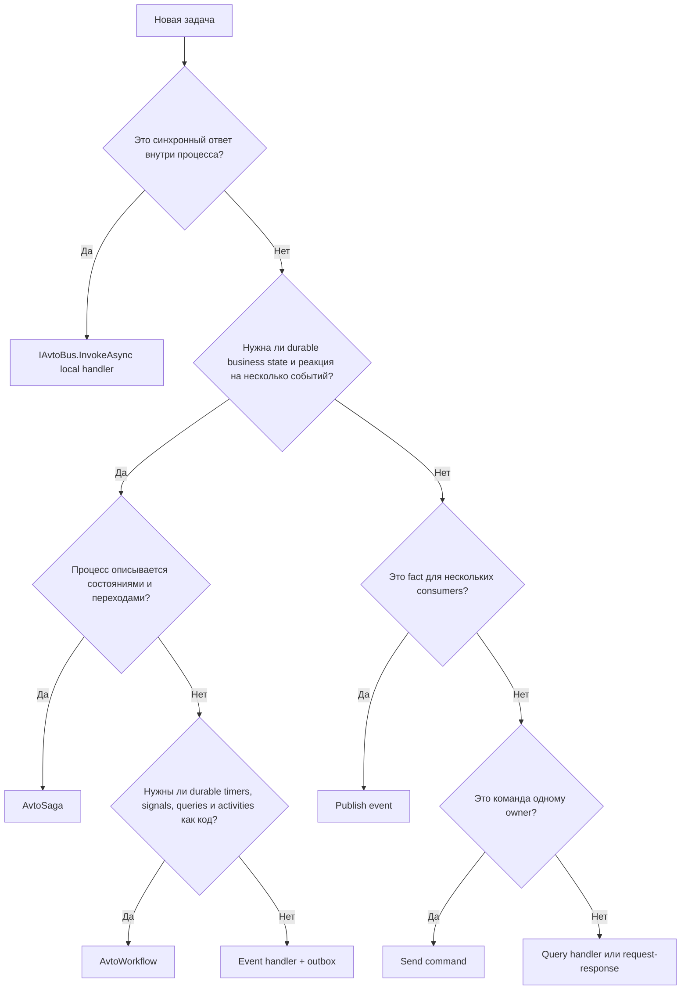
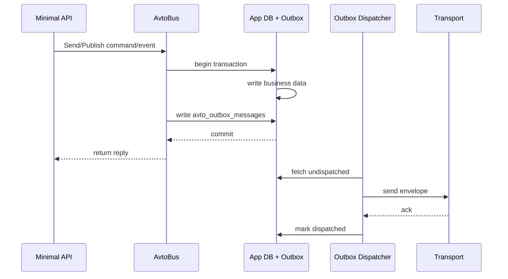
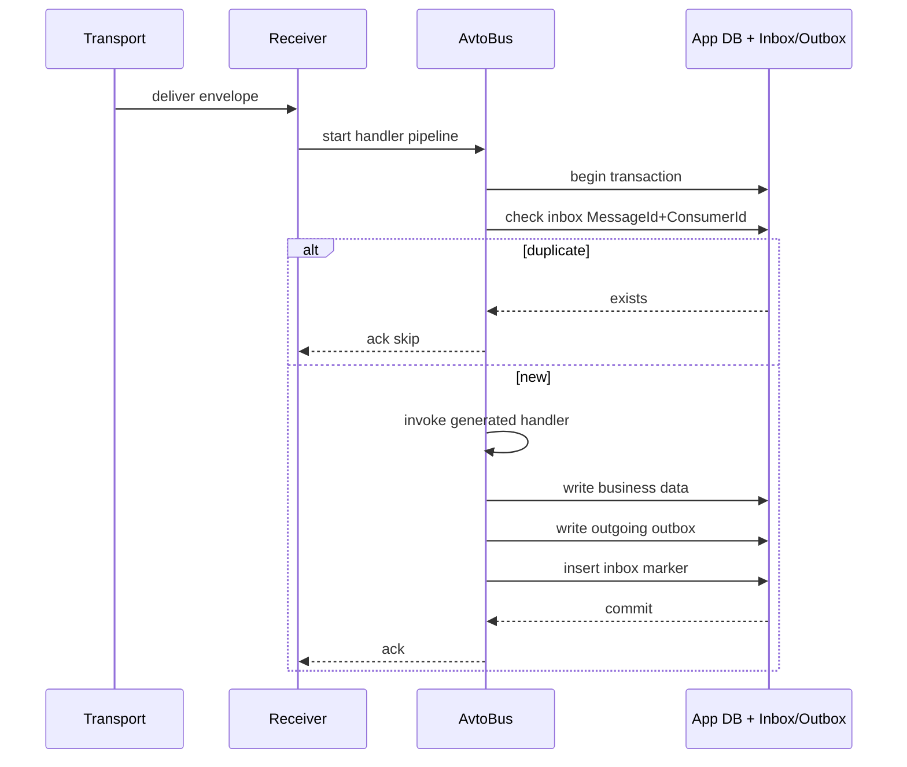
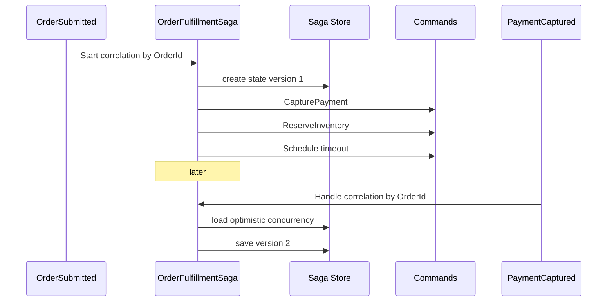

# AvtoBus: decision tree, anti-patterns, FAQ и glossary

## Decision tree

### Что использовать для конкретного сценария



### Event sourcing vs projection-only

Используй event sourcing, если:

- Нужен полный audit trail.
- Aggregate state сложно выразить текущим snapshot.
- Нужны temporal queries.
- Business требует replay и rebuild.

Используй projection-only с outbox, если:

- Источник истины - реляционная модель.
- Events нужны только для интеграции и read models.
- Команда и домен проще выражаются CRUD + domain events.

### Saga vs workflow

Saga лучше, когда:

- Процесс естественно описывается состоянием и сообщениями.
- Нужны compensation commands.
- Нет сложного кода с ветвлением, циклами и большим количеством activity calls.

Durable workflow лучше, когда:

- Процесс похож на код с await, timers, signals, queries.
- Нужна deterministic replay модель.
- Есть long-running human interaction или external callback waits.

### Kafka vs RabbitMQ vs NATS

Kafka, если:

- Нужен event log, replay, stream processing, partitions, compacted topics.
- Много consumers читают одни и те же события.

RabbitMQ, если:

- Нужны queues, routing, exchanges, request-response, delayed redelivery, mature ops.
- Commands и events смешаны в operational messaging.

NATS JetStream, если:

- Нужна низкая latency, lightweight deployment, pull consumers и simple stream model.
- Edge/IoT или high-throughput pub/sub без Kafka operational weight.

## Anti-patterns

### 1. Publish через injected bus глубоко в домене

Плохо:

```csharp
public class Order
{
    public void Submit(IAvtoBus bus)
    {
        Status = Submitted;
        bus.PublishAsync(new OrderSubmitted(Id));
    }
}
```

Почему плохо:

- Скрытый side effect.
- Нет transactional outbox guarantee.
- Тяжело тестировать.
- Домен зависит от infrastructure.

Хорошо:

```csharp
public static OrderSubmitted Handle(SubmitOrder command, AppDbContext db)
{
    var order = Order.Submit(command.OrderId);
    db.Orders.Add(order);
    return new OrderSubmitted(order.Id);
}
```

### 2. Один handler на все

Плохо: один `MessageHandler` с switch по типу сообщения.

Хорошо: один handler per message type, discovered by source generator.

### 3. Event как command

Плохо: использовать `Send` для fact, который должен иметь много subscribers.

Хорошо: `Publish` для events, `Send` для commands с одним owner.

### 4. Interface-only routing

Плохо: publish `IOrderEvent` и ожидать routing по интерфейсу.

Хорошо: publish concrete record `OrderSubmitted`, interface может быть marker для developer clarity.

### 5. Outbox без inbox

Плохо: полагаться только на at-least-once delivery и надеяться, что handler случайно idempotent.

Хорошо: outbox на producer + inbox/deduplication или явная idempotency на consumer.

### 6. Task.Delay в workflow

Плохо: `await Task.Delay(TimeSpan.FromMinutes(15))` внутри durable workflow.

Хорошо: `await context.CreateTimer(...)` или scheduled message в saga.

### 7. EF entity в message

Плохо: `new OrderSubmitted(orderEntity)`.

Хорошо: flat DTO record с primitives и stable schema.

### 8. Global ordering requirement

Плохо: требовать полный порядок всех событий системы.

Хорошо: ordering per aggregate/partition key.

### 9. Dashboard без authorization

Плохо: `app.MapAvtoBusDashboard("/avtobus")` без policy.

Хорошо: `.RequireAuthorization("Ops")` и audit log.

### 10. Replay без audit

Плохо: кнопка replay без записи кто, когда и почему.

Хорошо: replay action пишет audit event с user, reason и original dead-letter id.

## ADR-style decisions

### ADR-001: Concrete message routing

Статус: accepted.

Контекст: interface routing удобен для polymorphism, но ломает schema identity, versioning и source generation.

Решение: routing использует concrete message type. Interfaces могут быть marker contracts.

Последствия: миграция из MassTransit/NServiceBus interface contracts требует concrete records с aliases.

### ADR-002: Effects as return values

Статус: accepted.

Контекст: hidden bus publish усложняет testing и outbox guarantees.

Решение: handlers возвращают reply/events/commands/schedule effects. Source generator materializes их в outbox/reply pipeline.

Последствия: сложный code может выглядеть многословно, поэтому есть `AvtoEffects` helpers.

### ADR-003: Outbox by default для transactional handlers

Статус: accepted.

Контекст: большинство production инцидентов связано с lost send или zombie record.

Решение: если handler участвует в DB transaction и публикуются integration messages, outbox включается по умолчанию.

Последствия: нужна durable store configuration. Для pure in-memory scenarios можно явно отключить.

### ADR-004: Source-generated handlers

Статус: accepted.

Контекст: reflection-based dispatch мешает AOT, stack traces и performance predictability.

Решение: compile-time generator строит handler registry и pipeline code.

Последствия: нужно invest в analyzer diagnostics и generated code readability.

### ADR-005: Capability-based transports

Статус: accepted.

Контекст: brokers имеют разные semantics. Lowest common denominator API прячет важные возможности.

Решение: общий `IAvtoTransport` плюс capability flags и transport-specific configuration packages.

Последствия: routing policies должны проверять capabilities и выдавать diagnostics.

### ADR-006: CloudEvents as interop, AvtoEnvelope as internal model

Статус: accepted.

Контекст: polyglot systems нуждаются в стандарте, но internal model должен быть richer.

Решение: lossless mapping между AvtoEnvelope и CloudEvents. Internal pipeline работает с AvtoEnvelope.

Последствия: нужен explicit mapping tests per transport.

### ADR-007: Durable workflow as optional package

Статус: accepted.

Контекст: не всем нужен Temporal-like engine.

Решение: core messaging и sagas не зависят от workflow package. Workflow package может использовать embedded store или external Temporal backend в будущем.

Последствия: 1.0 может выпустить workflow как preview.

## FAQ

### AvtoBus заменяет MediatR?

Да для in-process command/event dispatch через `InvokeAsync` и local queues. Для distributed reliability он дает больше, чем MediatR.

### AvtoBus заменяет MassTransit/NServiceBus?

Может заменить, но migration должна быть gradual через interop adapters. Для 1.0 цель - parity в core reliability, а не во всех enterprise tools.

### Нужен ли отдельный сервер?

Нет для core messaging, outbox, inbox, sagas и projections. Durable workflows могут использовать embedded store. Temporal backend может быть optional в будущем.

### Можно ли без брокера?

Да. In-memory transport для tests, PostgreSQL/SQL Server transport или local queues для modular monolith.

### Как тестировать handlers?

Pure function handlers тестируются как обычные static methods. Для integration есть `AvtoBusTestHost` и harness для sent/published assertions.

### Как обрабатывать большие payload?

Claim Check pattern: payload сохраняется в blob store, в envelope идет pointer.

### Как масштабировать consumers?

Horizontal replicas + KEDA/HPA по `avtobus_endpoint_queue_depth` или consumer lag. Для ordered processing использовать partition key и partition concurrency.

### Что делать с breaking schema change?

CI должен fail через schema compatibility check. Для rollout использовать versioned topics или upcasters.

### Как replay dead-letter?

Через dashboard или CLI после исправления кода/schema. Replay пишет audit log.

### Как обеспечить exactly-once?

В общем случае нельзя. AvtoBus обеспечивает effectively-once effect через outbox + inbox/idempotent handlers. Внутри Kafka pipeline возможен exactly-once v2 при соответствующей конфигурации.

### Поддерживается ли Native AOT?

Цель - AOT-ready core через source generation. Reflection-heavy features должны быть в optional packages и помечены analyzer warnings.

### Можно ли использовать F#?

Да. Handlers могут быть F# functions. Records и discriminated unions хорошо подходят для messages и effects.

### Как AvtoBus относится к Dapr?

Dapr может быть transport adapter и sidecar runtime для polyglot infrastructure. AvtoBus не требует sidecar и дает richer C# domain model.

### Как AvtoBus относится к Aspire?

Aspire - orchestration и observability для local/cloud dev. AvtoBus.Aspire package дает resource bindings, OTLP defaults и dashboard integration.

## Glossary

- **Command**: намерение изменить состояние, один logical owner.
- **Event**: факт, который уже произошел, ноль или много subscribers.
- **Query**: запрос read model, без side effects.
- **Envelope**: transport-independent wrapper с metadata и payload.
- **Outbox**: таблица/хранилище исходящих сообщений внутри бизнес-транзакции.
- **Inbox**: deduplication store для входящих сообщений.
- **Dead letter**: сообщение после исчерпания retry policy.
- **Quarantine**:隔离 для poison messages, требующих ручного анализа.
- **Saga**: long-running process с persistent state и message correlation.
- **Workflow**: durable code process с history replay, timers, signals и activities.
- **Projection**: read model, построенный из events.
- **Stream processor**: stateful processor над event stream с windows и state stores.
- **Partition key**: ключ для ordering и concurrency affinity.
- **Schema version**: версия contract для compatibility checks.
- **Claim check**: pointer на large payload во внешнем storage.
- **Causation id**: id сообщения, которое вызвало текущее сообщение.
- **Correlation id**: id business flow, общий для цепочки сообщений.
- **Conversation id**: id request/response или workflow conversation.
- **Capability**: transport feature flag, например `Replay`, `Sessions`, `OffsetCommit`.

## Mermaid sequence diagrams

### Outbox producer flow



### Inbox consumer flow



### Saga correlation



## Open questions для community

1. Должен ли `ICommand`/`IEvent` быть mandatory marker interfaces или convention-only?
2. Нужен ли встроенный Temporal backend adapter в 1.x или только embedded workflow engine?
3. Должен ли schema registry быть embedded PostgreSQL по умолчанию или external-only?
4. Какой default retention для inbox: 7 дней, 30 дней или per-message policy?
5. Должен ли dashboard хранить payload snapshot для dead letters или только pointer?
6. Нужен ли official F# API package в 1.x?
7. Должен ли AvtoBus CLI быть global tool, local tool или оба?
