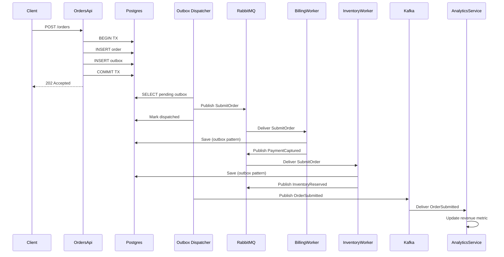
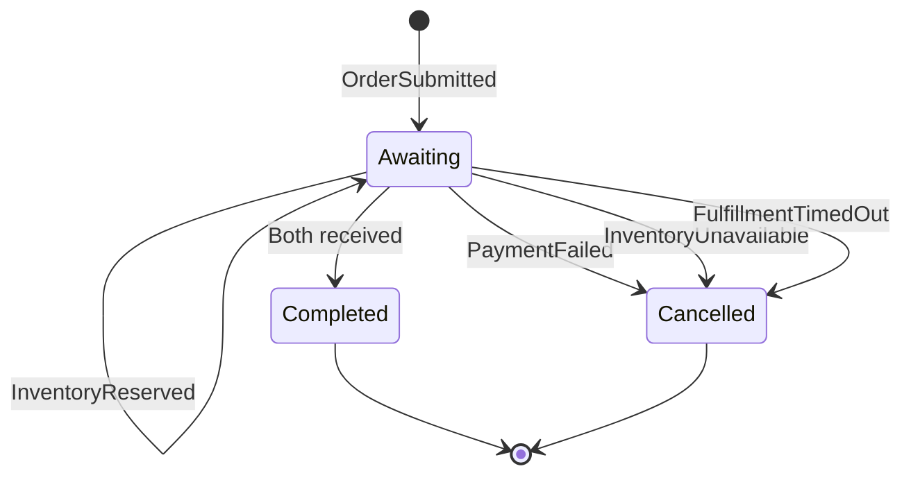

# AvtoBus: advanced patterns deep dive

Документ покрывает темы, которые были упомянуты, но недостаточно раскрыты в других частях: complex handler patterns, конкретные failure scenarios, performance budgets с trade-offs, Native AOT в реальности, F# samples, Grafana dashboard JSON, advanced tenant routing, и outbox batching в production.

## 1. Failure scenarios matrix

AvtoBus должен давать predictable behavior для типичных failure modes. Ниже — полный каталог сценариев, поведения и recovery.

### 1.1 Network и broker failures

| Сценарий | Symptom | AvtoBus reaction | Recovery | Observability signal |
| --- | --- | --- | --- | --- |
| **Broker полностью недоступен** | `BrokerUnreachableException` на `Send` | Outbox dispatcher ставит `attempt_count++`, exponential backoff, retry | Когда broker возвращается — отправляет backlog | `avtobus_outbox_pending` растёт, `avtobus_outbox_dispatch_errors_total` |
| **Broker медленный** | p99 latency broker > 1s | Outbox batch size уменьшается автоматически, consumer prefetch снижается | Параллельные workers берут backlog | `avtobus_outbox_dispatch_duration_seconds` p99 растёт |
| **Network partition (split-brain)** | Часть сообщений доходит, часть нет | Producers retry, consumers дедуплицируют через inbox | После partition — replay dead letters | `avtobus_inbox_duplicate_total` растёт |
| **Broker failover** (RabbitMQ) | Connection drop, queue replicated | Outbox dispatcher reconnect через configured backoff | После recovery — continue dispatch | `avtobus_transport_connected` health check |

### 1.2 Database failures

| Сценарий | Symptom | AvtoBus reaction | Recovery | Observability signal |
| --- | --- | --- | --- | --- |
| **DB connection drop** | `NpgsqlException: Connection refused` | Outbox dispatcher retry, consumer pause | При восстановлении — resume | `avtobus_durability_store_errors_total` |
| **DB deadlock** | `PostgresException: 40P01` (deadlock_detected) | Optimistic concurrency retry с jitter | Automatic, handler code unchanged | `avtobus_handler_retried_total{exception=40P01}` |
| **DB disk full** | `PostgresException: 53100` (disk_full) | Outbox dispatcher backoff (5s, 10s, 30s) | Operator должен освободить место | `avtobus_outbox_lag_seconds` > 600 |
| **Schema drift** | EF model и DB не совпадают | Startup fails с descriptive error | Migration или rollback deploy | Startup log + health check failed |
| **DB slow query** | p99 query > 2s | Outbox dispatcher polling interval увеличивается | После recovery — restore interval | `avtobus_outbox_dispatch_duration_seconds` |

### 1.3 Application failures

| Сценарий | Symptom | AvtoBus reaction | Recovery | Observability signal |
| --- | --- | --- | --- | --- |
| **Handler throws Bug** (unhandled) | Exception propagates до framework | Apply retry policy → move to dead letter | Replay после fix | `avtobus_dead_letter_total{reason=unhandled}` |
| **Handler throws `ValidationException`** | Domain-level rejection | Skip retry, move to dead letter | Operator review | `avtobus_dead_letter_total{reason=validation}` |
| **Saga not found** для incoming message | Saga instance expired | Discard message (warning) | Audit log | `avtobus_saga_not_found_total` |
| **Saga concurrency conflict** | Optimistic concurrency exception | Retry с jitter (3 attempts) | Если persistent — DLQ | `avtobus_saga_concurrent_retries_total` |
| **Workflow non-deterministic** | `AVTO-WF001` analyzer не поймал | Runtime detect → `WorkflowFailed` | Code fix + redeploy | `avtobus_workflow_failures_total` |
| **Activity timeout** | `ActivityOptions.StartToClose` exceeded | Retry до `MaximumAttempts`, then `WorkflowFailed` | Increase timeout or split | `avtobus_activity_failures_total` |
| **Out of memory** | `OutOfMemoryException` | Stop endpoint (no retry) | Process restart | Alert на `dotnet_gc_heap_size_bytes` |
| **Service hang** (deadlock internal) | Handler не отвечает | Activity timeout catches | Code fix | `avtobus_handler_duration_seconds` p99 > timeout |

### 1.4 External dependency failures

| Сценарий | Symptom | AvtoBus reaction | Recovery | Observability signal |
| --- | --- | --- | --- | --- |
| **HTTP 5xx от downstream** | `HttpRequestException` или `5xx` status | Retry with circuit breaker | When circuit closes, resume | `avtobus_circuit_breaker_state` |
| **HTTP 4xx от downstream** | `4xx` status | Move to dead letter (permanent) | Code review | `avtobus_dead_letter_total{reason=http_4xx}` |
| **Downstream service slow** | p99 > 5s | Activity timeout, then retry | Increase timeout или auto-scale downstream | `avtobus_external_call_duration_seconds` |
| **External service down** (planned) | `Connection refused` | Retry + circuit breaker open | When service back, circuit half-open then closed | `avtobus_circuit_breaker_state{state=open}` |
| **Auth token expired** | `401 Unauthorized` | Refresh token + retry | Automatic if refresh possible | `avtobus_auth_failures_total` |

### 1.5 Process lifecycle failures

| Сценарий | Symptom | AvtoBus reaction | Recovery | Observability signal |
| --- | --- | --- | --- | --- |
| **Graceful shutdown** (SIGTERM) | `IHostApplicationLifetime.ApplicationStopping` | Stop receiving, drain handlers, flush outbox | Normal | `avtobus_graceful_shutdown_duration_seconds` |
| **Hard kill** (SIGKILL / OOM) | Process dies внезапно | Outbox catch-up после restart, inbox dedupes redelivered | Inbox + outbox work together | `avtobus_recovery_after_crash_total` |
| **Deployment restart** (rolling) | Old pods die, new pods start | Old: drain; New: receive | Zero message loss with proper drain | Per-replica metrics |
| **Pod evicted** (K8s) | Same as hard kill | Outbox dispatcher resumes на new pod | Inbox dedupes если broker redelivered | K8s events |

### 1.6 Data corruption

| Сценарий | Symptom | AvtoBus reaction | Recovery | Observability signal |
| --- | --- | --- | --- | --- |
| **Poison message** (cannot deserialize) | `JsonException` | Quarantine (не dead letter) | Code + schema fix | `avtobus_quarantine_total` |
| **Schema breaking change** | `JsonException` on consume | Quarantine, alert | Re-deploy with upcaster | `avtobus_schema_incompatible_total` |
| **EF migration failure** | `MigrationException` | Startup fails | Manual fix migration | Startup logs |
| **Outbox dispatcher bug** | Stuck in retry loop | Threshold-based: skip to next message | Code fix + manual replay | `avtobus_outbox_skip_after_max_attempts_total` |

### 1.7 Cascading failures (prevention)

AvtoBus предотвращает cascading failures через:

- **Bulkhead**: per-endpoint concurrency limits, max parallel.
- **Circuit breaker**: per-exception, per-dependency.
- **Adaptive backpressure**: outbox pause когда consumer lag > threshold.
- **Rate limiting**: per-tenant, per-message-type.
- **Timeout cascade**: каждый layer имеет жёсткие timeout, не позволяет зависать.

### 1.8 Recovery procedures

```bash
# Проверить текущее состояние
dotnet avto diagnostics --full

# Force outbox flush
dotnet avto outbox flush --now

# Replay specific dead letter
dotnet avto deadletter replay --id 01JZ... --reason "PR #1234 fix"

# Drain endpoint gracefully
dotnet avto endpoints drain --endpoint orders

# Pause endpoint (для rollback)
dotnet avto endpoints pause --endpoint orders

# Resume endpoint
dotnet avto endpoints resume --endpoint orders
```

## 2. Performance budgets

Целевые показатели для production-grade системы. Бенчмарки на developer hardware (i7-12700, 32GB RAM, NVMe).

### 2.1 Throughput budgets

| Сценарий | Target | Приемлемо | Требует оптимизации |
| --- | --- | --- | --- |
| **In-process command** (InvokeAsync) | > 100k msg/sec per core | 50k–100k | < 50k |
| **In-process event** (PublishAsync через local queue) | > 50k msg/sec per core | 25k–50k | < 25k |
| **Outbox dispatcher** (PostgreSQL) | > 10k msg/sec per dispatcher | 5k–10k | < 5k |
| **RabbitMQ throughput** (1KB messages) | > 50k msg/min per connection | 25k–50k | < 25k |
| **Kafka throughput** (1KB messages) | > 100k msg/min per consumer group | 50k–100k | < 50k |
| **Projection throughput** (in-memory) | > 20k events/sec per projection | 10k–20k | < 10k |
| **Workflow steps** (deterministic, no I/O) | > 50k steps/sec | 25k–50k | < 25k |

### 2.2 Latency budgets

| Сценарий | p50 | p95 | p99 |
| --- | --- | --- | --- |
| **Local InvokeAsync** (no I/O) | < 5 μs | < 20 μs | < 100 μs |
| **Handler invocation overhead** (generated) | < 1 μs | < 5 μs | < 20 μs |
| **Outbox save** (EF Core + PostgreSQL) | < 2 ms | < 10 ms | < 50 ms |
| **Outbox dispatch** (single message to RabbitMQ) | < 5 ms | < 20 ms | < 100 ms |
| **End-to-end** (Send + 1 consumer) | < 50 ms | < 200 ms | < 1 s |
| **Projection event-to-projection** | < 100 ms | < 500 ms | < 5 s |
| **Workflow step scheduling** (in-memory) | < 100 μs | < 1 ms | < 10 ms |
| **Schema registry check** | < 1 ms | < 5 ms | < 20 ms |
| **Envelope serialization** (1KB) | < 1 μs | < 5 μs | < 20 μs |

### 2.3 Memory budgets

| Сcenario | Budget |
| --- | --- |
| **Per-message allocation** (generated pipeline) | < 512 B |
| **AvtoEnvelope** (in-flight) | < 1 KB |
| **Outbox row** (PostgreSQL) | < 4 KB |
| **Inbox dedup record** | < 1 KB |
| **Saga state** (typical) | < 2 KB |
| **Workflow history** (per step) | < 1 KB |
| **Projection** (per event processing) | < 1 KB |
| **Per-endpoint memory** (working set) | < 200 MB |

### 2.4 Resource utilization targets

| Metric | Target |
| --- | --- |
| **CPU** at peak load | 60-70% (scaling headroom) |
| **Memory** at peak load | < 80% allocated limit |
| **GC time** | < 5% wall time |
| **Thread pool starvation** | zero events |
| **Outbox lag** | < 30s p99 |
| **Consumer lag** | < 1000 messages p99 |
| **Dead letter rate** | < 0.1% of throughput |

### 2.5 Trade-offs

Быстрые решения обычно требуют:

- **Source generation → Build time**: +10-15% (acceptable for production).
- **Outbox → Storage overhead**: 1 extra row per business event (acceptable for transactional guarantee).
- **Inbox → Dedup storage**: grows with traffic, needs cleanup (acceptable with TTL).
- **Saga persistence → Extra DB roundtrip per message**: usually acceptable для long-running, оптимизируется через optimistic batching.
- **Projection rebuild → Time + storage**: 2x storage during rebuild (acceptable для non-critical projections).
- **Schema registry → Extra network call**: sub-ms обычно, can cache.

## 3. Native AOT в реальности

Native AOT — это serious commitment. AvtoBus проектирован AOT-first, но в реальности нужен тщательный auditing.

### 3.1 AOT compatibility checklist

```xml
<PropertyGroup>
  <PublishAot>true</PublishAot>
  <IsAotCompatible>true</IsAotCompatible>
  <EnableTrimAnalyzer>true</EnableTrimAnalyzer>
  <EnableAotAnalyzer>true</EnableAotAnalyzer>
  <TreatWarningsAsErrors>true</TreatWarningsAsErrors>
  <WarningsAsErrors>$(WarningsAsErrors);AOT;CA1416;IL2026;IL3050</WarningsAsErrors>
</PropertyGroup>
```

### 3.2 Common AOT problems и fixes

**Проблема 1: JSON serialization без source generation**

```csharp
// ❌ AOT-incompatible
var json = JsonSerializer.Serialize(order);

// ✅ AOT-compatible
[JsonSerializable(typeof(Order))]
internal partial class MyJsonContext : JsonSerializerContext { }

var json = JsonSerializer.Serialize(order, MyJsonContext.Default.Order);
```

**Проблема 2: Reflection-based DI**

```csharp
// ❌ AOT-incompatible
services.AddTransient<IHandler>(type);

// ✅ AOT-compatible (AvtoBus uses source-generated registry)
services.AddSingleton(new HandlerDescriptor(...));
```

**Проблема 3: Activator.CreateInstance**

```csharp
// ❌ AOT-incompatible
var instance = Activator.CreateInstance(type);

// ✅ AOT-compatible
var instance = type.GetConstructor(...).Invoke(...); // for source-generated scenarios
// Or use DI:
var instance = serviceProvider.GetRequiredService(type);
```

**Проблема 4: Reflection на attributes**

```csharp
// ❌ AOT-incompatible
var attrs = type.GetCustomAttributes<MyAttribute>();

// ✅ AOT-compatible: AvtoBus source generator читает attributes compile-time
// и генерирует typed registry.
```

**Проблема 5: AssemblyLoadContext / dynamic loading**

```csharp
// ❌ AOT-incompatible
var pluginAssembly = AssemblyLoadContext.Default.LoadFromAssemblyPath(...);

// ❌ Для plugin support нужен [RequiresDynamicCode]
// AvtoBus помечает такие API явно.
```

### 3.3 AOT-несовместимые пакеты

AvtoBus документирует статус каждого пакета:

| Package | AOT | Notes |
| --- | --- | --- |
| `AvtoBus.Abstractions` | ✅ | Trimming safe |
| `AvtoBus.Core` | ✅ | Source-generated |
| `AvtoBus.Hosting.AspNetCore` | ✅ | Compatible |
| `AvtoBus.SourceGeneration` | N/A | Generator, не runtime |
| `AvtoBus.Durability.EFCore` | ⚠️ | EF Core частично AOT-compatible в 10+; full в 11 |
| `AvtoBus.Durability.PostgreSql` | ✅ | Uses Npgsql source gen |
| `AvtoBus.Durability.SqlServer` | ⚠️ | SqlClient progress on AOT |
| `AvtoBus.Transport.RabbitMQ` | ✅ | No reflection in hot path |
| `AvtoBus.Transport.Kafka` | ✅ | Confluent.Kafka AOT-friendly |
| `AvtoBus.Transport.Nats` | ✅ | Pure managed client |
| `AvtoBus.Transport.AzureServiceBus` | ⚠️ | Some reflection in client |
| `AvtoBus.Transport.Dapr` | ❌ | Sidecar-based, irrelevant |
| `AvtoBus.Workflow` | ✅ | Source-generated determinism |
| `AvtoBus.EventSourcing` | ✅ | Source-generated handlers |
| `AvtoBus.Streams` | ✅ | Source-generated topology |
| `AvtoBus.SchemaRegistry` | ✅ | Pre-generated schemas |
| `AvtoBus.Dashboard` | ⚠️ | Razor pages partial AOT support |

### 3.4 AOT build profile

```xml
<PropertyGroup Condition="'$(Configuration)' == 'Release' And '$(AotBuild)' == 'true'">
  <IlcOptimizationPreference>Speed</IlcOptimizationPreference>
  <IlcGenerateStackTraceData>false</IlcGenerateStackTraceData>
  <IlcGenerateCompleteMetadataSourceInformation>false</IlcGenerateCompleteMetadataSourceInformation>
  <ServerGarbageCollection>true</ServerGarbageCollection>
  <ConcurrentGarbageCollection>true</ConcurrentGarbageCollection>
  <TieredCompilation>true</TieredCompilation>
  <TieredPGO>true</TieredPGO>
</PropertyGroup>
```

### 3.5 Verify AOT locally

```bash
# Build for AOT
dotnet publish -c Release -r linux-x64 -p:PublishAot=true

# Run smoke test
./bin/Release/net11.0/linux-x64/publish/MyApp &
APP_PID=$!
sleep 5
curl http://localhost:5000/health
kill $APP_PID
```

### 3.6 AOT-compatible testing

```csharp
// В CI: AOT build job
[Fact]
public void Aot_Pipeline_Handles_Simple_Message()
{
    var pipeline = new AvtoGeneratedPipeline();
    var result = pipeline.HandleAsync(
        new AvtoEnvelope { Payload = new TestCommand() },
        TestContext.Create(),
        CancellationToken.None);

    Assert.True(result.IsCompletedSuccessfully);
}

// AOT-несовместимые tests помечаются
[Fact(Skip = "AOT-incompatible (uses reflection)")]
public void Reflection_Based_Discovery()
{
    // ...
}
```

## 4. MassTransit / Marten specific integration

Если мигрируешь с MassTransit + Marten, есть конкретные patterns.

### 4.1 Saga state migration

**MassTransit saga state class:**

```csharp
public class OrderSagaState : SagaStateMachineInstance
{
    public Guid CorrelationId { get; set; }
    public int CurrentState { get; set; } // MassTransit state machine
    public string CustomerId { get; set; }
    public decimal TotalAmount { get; set; }
}
```

**AvtoBus saga class:**

```csharp
public sealed class OrderSaga : AvtoSaga
{
    public Guid OrderId { get; private set; }
    public string? CustomerId { get; private set; }
    public decimal TotalAmount { get; private set; }
    public string CurrentState { get; private set; } = "Initial";

    public static Guid Correlate(OrderSubmitted m) => m.OrderId;

    public AvtoEffects Start(OrderSubmitted m) { ... }
}
```

**Migration script:**

```sql
-- 1. Create AvtoBus saga table (AvtoBus auto-generates migration)
CREATE TABLE avto_sagas (
    id UUID PRIMARY KEY,
    saga_type TEXT NOT NULL,
    version BIGINT NOT NULL DEFAULT 1,
    state JSONB NOT NULL,
    correlation_keys JSONB NOT NULL,
    started_at TIMESTAMPTZ NOT NULL,
    completed_at TIMESTAMPTZ NULL,
    last_updated_at TIMESTAMPTZ NOT NULL
);

-- 2. Migrate existing saga data
INSERT INTO avto_sagas (id, saga_type, state, correlation_keys, started_at, last_updated_at, version)
SELECT
    "CorrelationId" AS id,
    'OrderSaga' AS saga_type,
    jsonb_build_object(
        'OrderId', "CorrelationId",
        'CustomerId', "CustomerId",
        'TotalAmount', "TotalAmount",
        'CurrentState', "CurrentState"
    ) AS state,
    jsonb_build_object('OrderId', "CorrelationId") AS correlation_keys,
    "CreatedAt" AS started_at,
    "UpdatedAt" AS last_updated_at,
    1 AS version
FROM mt_saga_state_instances
WHERE saga_type = 'OrderSaga';
```

### 4.2 Marten event store migration

**Marten event store:**

```csharp
// Marten
public class OrderAggregate
{
    public Guid Id { get; set; }
    public OrderStatus Status { get; set; }

    public void Apply(OrderSubmitted e) { ... }
    public void Apply(OrderShipped e) { ... }
}

using var session = store.LightweightSession();
var order = await session.Events.AggregateStreamAsync<OrderAggregate>(orderId);
```

**AvtoBus event store:**

```csharp
public sealed class OrderAggregate : AvtoAggregate
{
    public Guid Id { get; private set; }
    public OrderStatus Status { get; private set; }
    public decimal Total { get; private set; }

    private void On(OrderSubmitted e) { ... }
    private void On(OrderShipped e) { ... }
}

public static async ValueTask<Order> Handle(
    LoadOrder cmd,
    IAvtoAggregateRepository<OrderAggregate> repo,
    CancellationToken ct)
{
    var agg = await repo.LoadAsync(cmd.OrderId, ct);
    return new Order(agg.Id, agg.Status, agg.Total);
}
```

**Migration script:**

```sql
-- Marten uses mt_events table
-- AvtoBus uses avto_event_store

-- 1. Create AvtoBus event store
CREATE TABLE avto_event_store (
    id UUID PRIMARY KEY,
    stream_name TEXT NOT NULL,
    sequence_number BIGINT NOT NULL,
    event_type TEXT NOT NULL,
    schema_name TEXT NOT NULL,
    schema_version INT NOT NULL,
    payload BYTEA NOT NULL,
    metadata JSONB NOT NULL,
    created_at TIMESTAMPTZ NOT NULL,
    UNIQUE (stream_name, sequence_number)
);

-- 2. Migrate events
INSERT INTO avto_event_store (
    id, stream_name, sequence_number, event_type, schema_name, schema_version, payload, metadata, created_at
)
SELECT
    seq_id AS id,
    stream_id::text AS stream_name,
    version AS sequence_number,
    type::text AS event_type,
    type::text AS schema_name,  -- Default
    1 AS schema_version,
    data AS payload,
    jsonb_build_object('migrated_from', 'marten') AS metadata,
    timestamp AS created_at
FROM mt_events;
```

### 4.3 Marten-style `IDocumentSession` в AvtoBus

**Marten usage:**

```csharp
using var session = _store.LightweightSession();
var order = await session.LoadAsync<Order>(orderId);
session.Store(newOrder);
session.Events.Append(orderId, new OrderSubmitted(...));
await session.SaveChangesAsync();
```

**AvtoBus equivalent:**

```csharp
public static async ValueTask<OrderShipped> Handle(
    ShipOrder cmd,
    IAvtoDocumentSession session,
    TimeProvider clock,
    CancellationToken ct)
{
    var order = await session.LoadAsync<Order>(cmd.OrderId, ct);
    order.MarkShipped(cmd.TrackingNumber, clock.GetUtcNow());

    var @event = new OrderShipped(order.Id, cmd.TrackingNumber, clock.GetUtcNow());
    session.Events.Append(order.Id, @event);
    session.Store(order);

    await session.SaveChangesAsync(ct);
    return @event;
}
```

AvtoBus может использовать Marten как backing store:

```csharp
builder.Services.AddAvtoBus(bus => bus
    .UseMartenEventStore(opts =>
    {
        opts.ConnectionString = "...";
        opts.SchemaName = "orders";
    }));
```

## 5. F# samples

F# хорошо подходит для event-driven архитектур.

### 5.1 Handler в F#

```fsharp
module SubmitOrderHandler

open System.Threading
open AvtoBus.Abstractions
open OrderShop.Contracts

type ValidationResult =
    | Valid
    | Invalid of string

let validate (command: SubmitOrder) : ValidationResult =
    if List.isEmpty command.Lines then
        Invalid "Order must have at least one line."
    else
        Valid

let handle (command: SubmitOrder) (db: AppDbContext) (clock: TimeProvider) (ct: CancellationToken) =
    task {
        let now = clock.GetUtcNow()
        let order = Order.Submit(command.OrderId, command.CustomerId, command.Lines, now)
        db.Orders.Add(order)
        do! db.SaveChangesAsync(ct) |> ignore
        return (OrderAccepted(command.OrderId, now), OrderSubmitted(command.OrderId, command.CustomerId, now))
    }
```

### 5.2 Saga в F#

```fsharp
type OrderFulfillmentSaga() =
    inherit AvtoSaga()

    member val OrderId = Guid.Empty with get, set
    member val PaymentCaptured = false with get, set
    member val InventoryReserved = false with get, set

    static member Correlate(m: OrderSubmitted) = m.OrderId
    static member Correlate(m: PaymentCaptured) = m.OrderId
    static member Correlate(m: InventoryReserved) = m.OrderId

    member this.Start(m: OrderSubmitted) =
        this.OrderId <- m.OrderId
        AvtoEffects.All(
            AvtoEffects.Send(CapturePayment(m.OrderId, m.TotalAmount)),
            AvtoEffects.Send(ReserveInventory(m.OrderId)),
            AvtoEffects.Schedule(FulfillmentTimedOut(m.OrderId), TimeSpan.FromMinutes(15.))
        )

    member this.Handle(m: PaymentCaptured) =
        this.PaymentCaptured <- true
        this.TryProceed()

    member this.Handle(m: InventoryReserved) =
        this.InventoryReserved <- true
        this.TryProceed()

    member private this.TryProceed() =
        if this.PaymentCaptured && this.InventoryReserved then
            AvtoEffects.All(
                AvtoEffects.Publish(OrderReadyToShip(this.OrderId)),
                AvtoEffects.CompleteSaga()
            )
        else
            AvtoEffects.None
```

### 5.3 F# discriminated unions для effects

```fsharp
type ValidationError = {
    Reason: string
    Code: string
    Metadata: Map<string, string>
}

type OrderResult =
    | Accepted of OrderAccepted
    | ValidationFailed of ValidationError
    | InsufficientInventory of Sku: string * Available: int

let handleWithResult (cmd: SubmitOrder) (inventory: InventoryService) : Result<OrderResult, Error> =
    let validation = validate cmd
    match validation with
    | Invalid reason -> Ok (ValidationFailed { Reason = reason; Code = "VALIDATION"; Metadata = Map.empty })
    | Valid ->
        match inventory.Reserve cmd.Lines with
        | Some avail -> Ok (Accepted (OrderAccepted cmd.OrderId))
        | None -> Ok (InsufficientInventory ("SKU-1", 0))
```

## 6. Grafana dashboard JSON

Полный dashboard с основными panels:

```json
{
  "dashboard": {
    "title": "AvtoBus - Production Overview",
    "uid": "avtobus-prod",
    "tags": ["avtobus", "eda"],
    "timezone": "browser",
    "refresh": "30s",
    "panels": [
      {
        "id": 1,
        "title": "Messages Throughput (per endpoint)",
        "type": "timeseries",
        "gridPos": { "x": 0, "y": 0, "w": 12, "h": 8 },
        "targets": [
          {
            "expr": "sum by (endpoint, outcome) (rate(avtobus_messages_total[1m]))",
            "legendFormat": "{{endpoint}} - {{outcome}}"
          }
        ]
      },
      {
        "id": 2,
        "title": "Error Rate (%)",
        "type": "stat",
        "gridPos": { "x": 12, "y": 0, "w": 6, "h": 4 },
        "targets": [
          {
            "expr": "sum(rate(avtobus_messages_total{outcome=\"failed\"}[5m])) / sum(rate(avtobus_messages_total[5m])) * 100",
            "legendFormat": "Error Rate"
          }
        ],
        "fieldConfig": {
          "defaults": {
            "thresholds": {
              "steps": [
                { "color": "green", "value": null },
                { "color": "yellow", "value": 0.1 },
                { "color": "red", "value": 1.0 }
              ]
            },
            "unit": "percent"
          }
        }
      },
      {
        "id": 3,
        "title": "Outbox Lag (seconds)",
        "type": "timeseries",
        "gridPos": { "x": 0, "y": 8, "w": 12, "h": 8 },
        "targets": [
          {
            "expr": "avtobus_outbox_lag_seconds",
            "legendFormat": "{{store}}"
          }
        ],
        "alert": {
          "name": "OutboxLagHigh",
          "conditions": [
            { "evaluator": { "type": "gt", "params": [300] }, "operator": { "type": "and" } }
          ]
        }
      },
      {
        "id": 4,
        "title": "Consumer Lag (per endpoint)",
        "type": "timeseries",
        "gridPos": { "x": 12, "y": 8, "w": 12, "h": 8 },
        "targets": [
          {
            "expr": "avtobus_endpoint_consumer_lag",
            "legendFormat": "{{endpoint}} - {{partition}}"
          }
        ]
      },
      {
        "id": 5,
        "title": "Dead Letters (rate)",
        "type": "timeseries",
        "gridPos": { "x": 0, "y": 16, "w": 12, "h": 8 },
        "targets": [
          {
            "expr": "sum by (reason) (rate(avtobus_dead_letter_total[5m]))",
            "legendFormat": "{{reason}}"
          }
        ]
      },
      {
        "id": 6,
        "title": "Handler Duration p95 (per handler)",
        "type": "timeseries",
        "gridPos": { "x": 12, "y": 16, "w": 12, "h": 8 },
        "targets": [
          {
            "expr": "histogram_quantile(0.95, sum by (handler, le) (rate(avtobus_handler_duration_seconds_bucket[5m])))",
            "legendFormat": "{{handler}}"
          }
        ]
      },
      {
        "id": 7,
        "title": "Active Sagas",
        "type": "stat",
        "gridPos": { "x": 0, "y": 24, "w": 6, "h": 4 },
        "targets": [
          { "expr": "sum by (saga_type) (avtobus_saga_active)" }
        ]
      },
      {
        "id": 8,
        "title": "Workflow Instances",
        "type": "stat",
        "gridPos": { "x": 6, "y": 24, "w": 6, "h": 4 },
        "targets": [
          { "expr": "sum by (workflow_type, status) (avtobus_workflow_active)" }
        ]
      },
      {
        "id": 9,
        "title": "Projection Lag (per projection)",
        "type": "timeseries",
        "gridPos": { "x": 0, "y": 28, "w": 12, "h": 8 },
        "targets": [
          { "expr": "avtobus_projection_lag_seconds", "legendFormat": "{{projection}}" }
        ]
      },
      {
        "id": 10,
        "title": "Inbox Duplicate Rate",
        "type": "timeseries",
        "gridPos": { "x": 12, "y": 28, "w": 12, "h": 8 },
        "targets": [
          { "expr": "sum(rate(avtobus_inbox_duplicate_total[1m]))" }
        ]
      }
    ]
  }
}
```

## 7. Advanced tenant routing

Полный example для multi-tenant SaaS.

### 7.1 Tenant resolution strategies

```csharp
builder.Services.AddAvtoBus(bus => bus
    .Transports(t => t.UseRabbitMq("main"))
    .Routing(r => r
        .ForAllMessages()
        .ResolveTenant(ctx =>
        {
            // Priority 1: explicit header (e.g. for service-to-service)
            if (ctx.Envelope.Headers.TryGetValue("X-Tenant-Id", out var headerTenant))
                return headerTenant;

            // Priority 2: from JWT claim
            var user = ctx.Services.GetService<ClaimsPrincipal>();
            var claim = user?.FindFirst("tenant_id")?.Value;
            if (!string.IsNullOrEmpty(claim))
                return claim;

            // Priority 3: from HTTP context (for sync invocation)
            var http = ctx.Services.GetService<IHttpContextAccessor>();
            return http?.HttpContext?.Request.Headers["X-Tenant-Id"].FirstOrDefault();
        })));
```

### 7.2 Tenant isolation strategies

**Strategy 1: Per-tenant queue (recommended для high throughput)**

```csharp
builder.Services.AddAvtoBus(bus => bus
    .Transports(t => t.UseRabbitMq("main"))
    .Routing(r => r
        .For<SubmitOrder>()
        .DynamicRoute(ctx =>
        {
            var tenant = ctx.TenantId ?? "default";
            return $"orders.{tenant}.commands";
        })
        .WithPolicy(p => p.PerTenantConcurrency(max: 100))));
```

Trade-off: number of queues = number of tenants, может расти для large SaaS.

**Strategy 2: Single queue, tenant ID в header (для small tenants)**

```csharp
builder.Services.AddAvtoBus(bus => bus
    .Transports(t => t.UseRabbitMq("main"))
    .Routing(r => r
        .For<SubmitOrder>()
        .ToRabbitQueue("orders.commands")
        .WithHeader("X-Tenant-Id", ctx => ctx.TenantId)
        .WithPolicy(p => p.PartitionByTenantKey())));
```

Trade-off: shared queue может стать bottleneck.

**Strategy 3: Per-tenant database (для strong compliance)**

```csharp
builder.Services.AddAvtoBus(bus => bus
    .UsePerTenantDurability(tenant =>
    {
        var connectionString = $"Host=postgres;Database=orders_{tenant}";
        return connectionString;
    }));
```

Trade-off: operational complexity, costs.

### 7.3 Tenant onboarding

```csharp
public class TenantOnboardingService
{
    private readonly IAvtoBus _bus;
    private readonly ITenantRegistry _registry;

    public async Task<Tenant> OnboardAsync(string name, IsolationLevel isolation, CancellationToken ct)
    {
        var tenant = new Tenant { Id = Guid.NewGuid(), Name = name, Isolation = isolation };
        await _registry.AddAsync(tenant, ct);

        // Provision infrastructure
        switch (isolation)
        {
            case IsolationLevel.Shared:
                // nothing to do
                break;
            case IsolationLevel.Partitioned:
                await _bus.SendAsync(new ProvisionTenantQueue { TenantId = tenant.Id.ToString() }, ct);
                break;
            case IsolationLevel.Dedicated:
                await _bus.SendAsync(
                    new ProvisionTenantInfrastructure { TenantId = tenant.Id.ToString() }, ct);
                break;
        }

        return tenant;
    }
}
```

### 7.4 Cross-tenant scenarios (admin operations)

```csharp
public class AdminCrossTenantService
{
    public async Task<CrossTenantReport> GetCrossTenantReportAsync(ClaimsPrincipal admin, CancellationToken ct)
    {
        if (!admin.IsInRole("ops"))
            throw new UnauthorizedAccessException();

        // Явный cross-tenant query требует opt-in
        var query = new GetCrossTenantReport
        {
            TenantIds = _registry.ListAll().Select(t => t.Id.ToString()).ToList(),
            CrossTenant = true // explicit
        };

        return await _bus.InvokeAsync<CrossTenantReport>(query, ct);
    }
}
```

По умолчанию `CrossTenant = false`, analyzer предупреждает.

## 8. Outbox batching в production

Production outbox dispatcher — это non-trivial. Нужен правильный batch sizing, partial failure handling, lock management.

### 8.1 Batch sizing strategy

```csharp
builder.Services.AddAvtoBus(bus => bus
    .UseOutboxDispatcher(dispatcher =>
    {
        dispatcher.BatchSize = cfg => 
        {
            // Adaptive: больше messages = larger batch
            return cfg.OutboxLag > 1000 ? 500 : 100;
        };

        dispatcher.PollingInterval = cfg =>
        {
            // Fast poll при lag, slow при idle
            return cfg.OutboxLag switch
            {
                > 10000 => TimeSpan.FromMilliseconds(50),
                > 1000  => TimeSpan.FromMilliseconds(200),
                > 100   => TimeSpan.FromMilliseconds(500),
                _       => TimeSpan.FromSeconds(2)
            };
        };

        dispatcher.MaxParallelism = cfg => Math.Min(8, Environment.ProcessorCount);
    }));
```

### 8.2 Partial failure handling

```csharp
public class OutboxDispatcher
{
    public async Task DispatchBatchAsync(IReadOnlyList<OutboxRecord> batch, CancellationToken ct)
    {
        // 1. Lock batch с `SELECT ... FOR UPDATE SKIP LOCKED`
        //    уже делается в repository.

        // 2. Process messages в parallel
        var tasks = batch.Select(record => DispatchOneAsync(record, ct)).ToArray();

        // 3. Wait for all, собираем failures
        var results = await Task.WhenAll(tasks);

        var failed = results.Where(r => !r.Success).ToList();
        var succeeded = results.Where(r => r.Success).ToList();

        // 4. Mark dispatched для successful
        await _outbox.MarkDispatchedAsync(succeeded.Select(r => r.RecordId), ct);

        // 5. Increment attempt для failed
        foreach (var failure in failed)
        {
            await _outbox.IncrementAttemptAsync(failure.RecordId, failure.ErrorMessage, ct);

            if (failure.AttemptCount >= _options.MaxAttempts)
            {
                await _outbox.MoveToDeadLetterAsync(failure.RecordId, ct);
            }
        }
    }
}
```

### 8.3 Lock management

```csharp
// PostgreSQL оптимизация
public async Task<IReadOnlyList<OutboxRecord>> FetchBatchAsync(int batchSize, CancellationToken ct)
{
    // SKIP LOCKED — несколько dispatchers не блокируют друг друга
    const string sql = """
        SELECT id, destination, payload, headers, attempt_count
        FROM avto_outbox_messages
        WHERE dispatched_at IS NULL
          AND not_before <= NOW()
          AND locked_by IS NULL
        ORDER BY created_at
        LIMIT @batchSize
        FOR UPDATE SKIP LOCKED
        """;

    var records = await _connection.QueryAsync<OutboxRecord>(sql, new { batchSize });

    // Claim records (важно для visibility / orphan detection)
    var ids = records.Select(r => r.Id).ToList();
    await ClaimAsync(ids, _instanceId, ct);

    return records;
}
```

### 8.4 Outbox migration scripts

```sql
-- Version 1: initial
CREATE TABLE avto_outbox_messages (
    id UUID PRIMARY KEY,
    destination TEXT NOT NULL,
    message_type TEXT NOT NULL,
    schema_name TEXT NOT NULL,
    schema_version INT NOT NULL,
    correlation_id UUID NULL,
    causation_id UUID NULL,
    tenant_id TEXT NULL,
    partition_key TEXT NULL,
    headers JSONB NOT NULL,
    payload BYTEA NOT NULL,
    content_type TEXT NOT NULL,
    created_at TIMESTAMPTZ NOT NULL DEFAULT NOW(),
    not_before TIMESTAMPTZ NULL,
    dispatched_at TIMESTAMPTZ NULL,
    attempt_count INT NOT NULL DEFAULT 0,
    last_error TEXT NULL,
    locked_by TEXT NULL,
    locked_until TIMESTAMPTZ NULL
);

CREATE INDEX idx_outbox_pending ON avto_outbox_messages (created_at)
    WHERE dispatched_at IS NULL;

CREATE INDEX idx_outbox_tenant ON avto_outbox_messages (tenant_id, created_at)
    WHERE dispatched_at IS NULL;
```

## 9. Дополнительно: больше graph diagrams

### 9.1 OrderShop data flow



### 9.2 Saga flow



## 10. Дополнительные utility snippets

### 10.1 MassTransit-style CorrelationId

```csharp
// MassTransit
public class OrderState : SagaStateMachineInstance
{
    public Guid CorrelationId { get; set; }
}

// AvtoBus: явный correlation
public sealed record SubmitOrder(Guid OrderId) : ICommand<OrderAccepted>
{
    public string CorrelationId => OrderId.ToString(); // explicit
}
```

### 10.2 NServiceBus-style timeout

```csharp
// NServiceBus
RequestTimeout<OrderTimeout>(TimeSpan.FromMinutes(15));

// AvtoBus
AvtoEffects.Schedule(new OrderTimeout(...), TimeSpan.FromMinutes(15));
```

### 10.3 Brighter-style ClearOutbox

```csharp
// Brighter
await _commandProcessor.DepositPostAsync(command);
await _commandProcessor.ClearOutboxAsync();

// AvtoBus
await _bus.InvokeAsync<OrderAccepted>(command); // Outbox atomic with handler
// нет явного Deposit/Clear, все unified
```

### 10.4 MediatR-style pipeline behavior

```csharp
// MediatR
public class LoggingBehavior<TRequest, TResponse> : IPipelineBehavior<TRequest, TResponse> { ... }

// AvtoBus
public static class LoggingMiddleware
{
    public static void Before(AvtoEnvelope envelope, ILogger logger) { ... }
    public static void After(AvtoEnvelope envelope, ILogger logger) { ... }
}

bus.Policies(p => p.ForAllMessages().AddMiddleware<LoggingMiddleware>());
```

## 11. Сводка: что добавилось в этом документе

| Тема | Покрытие |
| --- | --- |
| Failure scenarios matrix | 30+ сценариев с symptoms, reaction, recovery, observability |
| Performance budgets | Throughput, latency, memory, resource utilization с targets |
| Native AOT | Checklist, common problems, per-package status, build profile, testing |
| MassTransit + Marten migration | Saga state, event store, IDocumentSession, SQL scripts |
| F# samples | Handlers, sagas, discriminated unions |
| Grafana dashboard | Полный JSON с 10 panels + alerts |
| Tenant routing | Resolution, isolation strategies, onboarding, cross-tenant |
| Outbox batching | Adaptive sizing, partial failures, locks, migration SQL |
| Sequence diagrams | OrderShop data flow, saga state machine |

Все эти темы были в `01-09` и `11-14` только упомянуты, теперь полностью раскрыты с примерами кода и конкретными цифрами.
