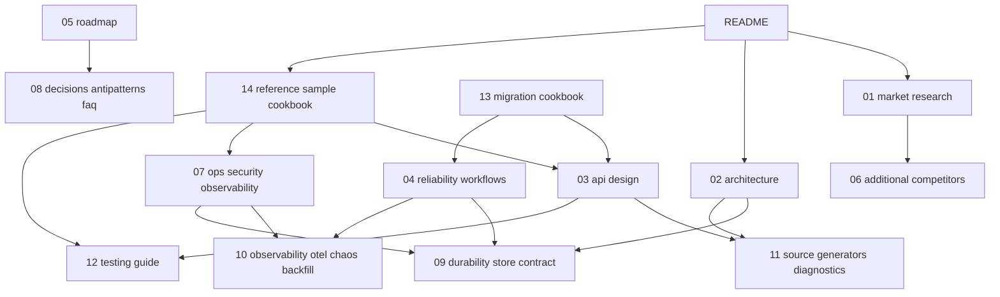

# AvtoBus: проект EDA-фреймворка для ASP.NET Core 10-11

AvtoBus - проект мощного event-driven application framework для .NET 10/11 и ASP.NET Core 10/11. Цель - объединить лучшие идеи MassTransit, NServiceBus, Wolverine, CAP, Brighter, Rebus, Dapr, Temporal, Kafka Streams, Spring Cloud Stream, Watermill, Axon и других систем в один современный C#-first фреймворк.

> **Статус (2026-08-27):** `AvtoBus.Core/Abstractions/Hosting/Dashboard/EFCore/RabbitMQ/InMemory/Workflow/Streams` — **stable** (`build 0W/0E, 9/9 tests`). `AvtoBus.Workflow` — durable timer/activity/history via `IScheduledStore`, `AvtoBus.Streams` — `IStateStore`/`InMemoryStateStore`/`StatefulProcessor` + Window (см. `StreamProcessor.cs`). `Kafka/NATS` — channel-backed для dev/test без брокера (Confluent.Kafka/NATS JetStream в прод). `Cli` — `migrate` требует `--connection`.

## Краткий вывод

AvtoBus должен быть не просто оберткой над брокером, а полным EDA-ядром для приложений:

- In-process mediator, distributed messaging, durable outbox/inbox, sagas, workflows, event sourcing, projections и stream processing в одной модели.
- ASP.NET Core 10/11 first: Generic Host, DI, health checks, OpenTelemetry, Aspire, System.Text.Json source generation, Native AOT/trimming readiness.
- Source-generated runtime: минимум reflection, быстрые обработчики, чистые stack traces, предсказуемая производительность.
- Reliability by default: outbox/inbox, idempotency, retries, scheduled retries, dead-letter, quarantine, backpressure и circuit breakers включаются как стандартный путь, а не как опция после инцидента.
- Transport-neutral, но не lowest common denominator: RabbitMQ, Kafka/Redpanda, NATS JetStream, Azure Service Bus, Event Hubs, AWS SQS/SNS/EventBridge, PostgreSQL/SQL Server transport, Redis Streams, Pulsar, MQTT и Dapr Pub/Sub адаптеры с capability model.
- CloudEvents и W3C trace context по умолчанию для межъязыковой совместимости.

## Документы

- **[AVTOBUS-FULL-IMPLEMENTATION.md](AVTOBUS-FULL-IMPLEMENTATION.md) — ГЛАВНЫЙ ДОКУМЕНТ: полная архитектура + полный код реализации ядра в одном файле** (abstractions, pipeline, outbox/inbox, sagas, retry/DLQ, InMemory + RabbitMQ транспорты, EF Core durability, hosting/DI, test harness, пример приложения с тестом).
- [01-market-research.md](01-market-research.md) - анализ конкурентов в .NET и других языках, что взять и чего избежать.
- [02-architecture.md](02-architecture.md) - архитектура AvtoBus, модули, runtime pipeline и интеграция с ASP.NET Core 10/11.
- [03-api-design.md](03-api-design.md) - публичный C# API, примеры регистрации, сообщений, handlers, маршрутизации и тестирования.
- [04-reliability-workflows.md](04-reliability-workflows.md) - outbox/inbox, delivery guarantees, sagas, durable workflows, event sourcing, projections, stream processing.
- [05-roadmap.md](05-roadmap.md) - roadmap, package layout, MVP, benchmarks, migration strategy и критерии качества.
- [06-additional-competitors.md](06-additional-competitors.md) - дополнительные конкуренты: DTFx, Durable Functions, Orleans, Akka.Persistence, KEDA, RabbitMQ Streams, Redpanda, NATS JetStream, gRPC, Confluent Schema Registry, AsyncAPI, CloudEvents, Debezium, Hangfire/Quartz, Pact.
- [07-operations-security-observability.md](07-operations-security-observability.md) - production-grade observability, metrics catalog, SLO, security, PII/GDPR, Claim Check, KEDA, graceful shutdown, disaster recovery.
- [08-decisions-antipatterns-faq.md](08-decisions-antipatterns-faq.md) - decision tree, anti-patterns, ADR, FAQ, glossary, Mermaid sequence diagrams.
- [09-durability-store-contract.md](09-durability-store-contract.md) - SQL-схемы всех store'ов, состояния, lock model, batch dispatch, idempotency key, миграции, recovery matrix.
- [10-observability-otel-chaos-backfill.md](10-observability-otel-chaos-backfill.md) - OpenTelemetry semantic conventions для messaging, span tree, clock skew, chaos testing matrix, backfill workflow, replay CLI.
- [11-source-generators-deep-dive.md](11-source-generators-deep-dive.md) - глубокий разбор source generators: incremental pipeline, полные примеры generated code для всех 8 generators, 40+ diagnostics IDs с CodeFixProvider, AOT compliance matrix, debugging, testing generators, benchmarks.
- [12-testing-guide.md](12-testing-guide.md) - 6-уровневая пирамида тестов (unit → component → integration → contract → e2e → chaos), golden envelope, property-based, mutation testing, deterministic time для sagas/workflows.
- [13-migration-cookbook.md](13-migration-cookbook.md) - side-by-side примеры кода для миграции с MediatR, MassTransit, NServiceBus, CAP, Wolverine, Dapr; общая migration strategy в 4 phases.
- [14-reference-sample-and-cookbook.md](14-reference-sample-and-cookbook.md) - полный OrderShop reference sample с Aspire/K8s/KEDA + 20 практических cookbook рецептов + runbooks.
- [15-advanced-patterns-and-deep-dive.md](15-advanced-patterns-and-deep-dive.md) - failure scenarios matrix (30+ сценариев), performance budgets, Native AOT в реальности, MassTransit+Marten миграция, F# samples, Grafana dashboard JSON, advanced tenant routing, outbox batching в production, sequence diagrams.
- [CHANGELOG.md](CHANGELOG.md) - история изменений самой документации.

## Порядок чтения

Для разных ролей:

**Архитектор оценивает фреймворк:**
1. README (эта страница)
2. 01-market-research → 06-additional-competitors
3. 02-architecture → 09-durability-store-contract
4. 08-decisions-antipatterns-faq

**Разработчик начинает использовать:**
1. README
2. 14-reference-sample-and-cookbook (OrderShop + рецепты)
3. 03-api-design
4. 12-testing-guide
5. 11-source-generators-and-diagnostics (когда analyzer выдаст warning)

**SRE / DevOps готовит к production:**
1. 07-operations-security-observability
2. 10-observability-otel-chaos-backfill
3. 09-durability-store-contract
4. 14 (runbooks section)

**Команда мигрирует существующее приложение:**
1. 13-migration-cookbook
2. 08-decisions-antipatterns-faq (anti-patterns)
3. 04-reliability-workflows
4. 12-testing-guide

**Contributor / maintainer AvtoBus:**
1. Всё, начиная с 05-roadmap
2. Особо: 11-source-generators-and-diagnostics и 09-durability-store-contract

## Dependency graph документов

## Сравнение AvtoBus и альтернатив

| Сценарий | Типичный выбор сейчас | AvtoBus закрывает |
| --- | --- | --- |
| In-process mediator | MediatR | `InvokeAsync` + local queues + source generation |
| Distributed messaging | MassTransit, NServiceBus, Rebus, CAP | единый bus + outbox/inbox + routing + policies |
| Operational outbox/dashboard | CAP | встроенные outbox, inbox, dead-letter, dashboard, CLI |
| Saga / process manager | NServiceBus sagas, MassTransit state machines | saga + optimistic concurrency + correlation conventions |
| Durable workflow | Temporal, DTFx, Durable Functions | optional workflow package + deterministic analyzers |
| Event sourcing | Marten, EventFlow, EventStoreDB, Axon | optional event store + projections + snapshots + upcasters |
| Stream processing | Kafka Streams, Flink | optional Streams package с capability-aware primitives |
| Polyglot interop | Dapr, CloudEvents | Dapr transport adapter + CloudEvents mapping |
| Autoscaling | KEDA + broker metrics | built-in metrics + KEDA ScaledObject export |

## Когда использовать AvtoBus

- Нужен один framework для local mediator, distributed messaging, outbox/inbox и sagas.
- Нужна reliability by default без ручного wiring каждой библиотеки.
- Нужна source-generated и AOT-friendly модель на ASP.NET Core 10/11.
- Нужен gradual migration из MassTransit/NServiceBus/CAP/Dapr.
- Нужен event platform с projections, event sourcing и stream processing в будущем.

Когда AvtoBus избыточен:

- Маленький monolith с одним background job и без distributed messaging.
- Уже зрелая NServiceBus/MassTransit установка без боли и без плана миграции.
- Только streaming analytics без transactional messaging, тогда Kafka Streams/Flink могут быть ближе.

## Позиционирование

AvtoBus должен закрывать 4 режима, которые сегодня часто требуют 4 разных библиотек:

| Режим | Сегодня часто используют | AvtoBus должен дать |
| --- | --- | --- |
| In-process commands/events | MediatR, Wolverine local queues | `IAvtoBus.InvokeAsync`, локальные очереди, source-generated handlers |
| Distributed messaging | MassTransit, NServiceBus, Rebus, CAP, Brighter | единая модель send/publish/request с outbox/inbox и routing policies |
| Long-running workflows | NServiceBus sagas, MassTransit state machines, Temporal, Dapr Workflow | lightweight sagas + durable workflow engine with timers/signals/queries |
| Event sourcing и projections | Marten, EventStoreDB, Axon, EventFlow | event store abstraction, aggregate streams, projections, snapshots, upcasters |

## Главные design-принципы

1. Reliable by default: если сообщение создается внутри бизнес-транзакции, оно должно идти через outbox автоматически.
2. Explicit contracts: команды, события и queries являются стабильными boundary contracts, версионируются и публикуются как AsyncAPI/JSON Schema/Protobuf schemas.
3. Concrete messages, typed routing: routing строится по concrete record/class и schema identity, не по случайным строкам.
4. Pure handlers first: обработчик может быть обычным static method без наследования, а зависимости передаются параметрами метода.
5. Effects as return values: handler возвращает события, команды, schedule, storage operations и replies явно, без скрытого bus publish глубоко в домене.
6. Capability-based transports: Kafka, RabbitMQ и Azure Service Bus имеют разные свойства, AvtoBus обязан показывать эти различия в API.
7. Observable by construction: OpenTelemetry traces, metrics, structured logs, message headers, dashboard и replay tools идут в базовой поставке.
8. Migration-friendly: interop с MassTransit/NServiceBus/Dapr/CloudEvents и адаптеры, чтобы можно было внедрять AvtoBus постепенно.

## Лучшее решение в одном предложении

AvtoBus = Wolverine-style source-generated pure handlers + MassTransit/NServiceBus-grade reliability and operations + CAP-style simple outbox/dashboard + Temporal-style durable workflows + Kafka Streams-style stateful stream processing + Dapr/CloudEvents portability.

## Основные источники исследования

- MassTransit docs: https://masstransit.massient.com/
- NServiceBus transport transactions/outbox: https://docs.particular.net/transports/transactions
- Wolverine migration and code generation model: https://wolverinefx.net/guide/migrating-to-wolverine.html
- CAP README and docs: https://github.com/dotnetcore/CAP
- Dapr overview: https://docs.dapr.io/concepts/overview/
- Temporal .NET introduction: https://temporal.io/blog/introducing-temporal-dotnet
- Kafka Streams core concepts: https://kafka.apache.org/42/streams/core-concepts/
- Spring Cloud Stream project: https://spring.io/projects/spring-cloud-stream
- Watermill CQRS docs: https://watermill.io/docs/cqrs/
- Brighter outbox pattern docs: https://brightercommand.gitbook.io/paramore-brighter-documentation/event-driven-architectures/outboxpattern
- .NET 11 overview: https://learn.microsoft.com/en-us/dotnet/core/whats-new/dotnet-11/overview
- ASP.NET Core 10 release notes: https://learn.microsoft.com/en-us/aspnet/core/release-notes/aspnetcore-10.0
